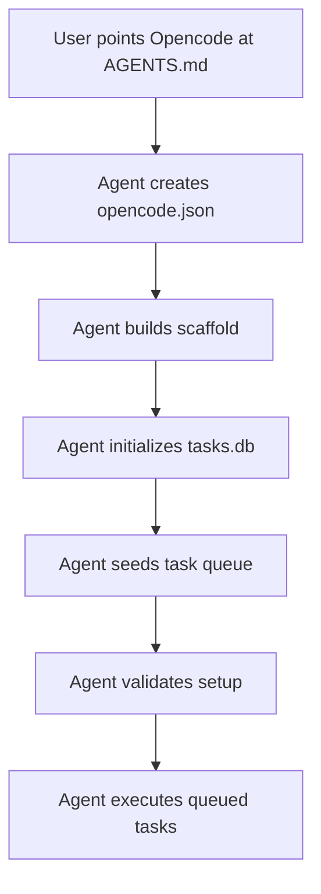

# SQLite Task Board Opencode Bootstrap

*A minimal local bootstrap framework for running one autonomous Opencode execution agent from a SQLite task queue.*

Point Opencode at **`AGENTS.md`**, and the agent configures the project itself.

---

## What It Does

This framework turns a single **`AGENTS.md`** file into a working local agent runtime. The agent will:

1. Read **`AGENTS.md`** as the source of truth.
2. Create **`opencode.json`** first so future Opencode sessions load the same instructions.
3. Generate the required project scaffold.
4. Create local configuration files.
5. Initialize a SQLite **`tasks.db`**.
6. Seed the first task queue.
7. Validate the runtime.
8. Begin executing work from the SQLite queue.

After bootstrap, normal work flows through the task board instead of ad hoc commands.

---

## Project Structure

```
sqlite-task-board/
├── AGENTS.md
├── README.md
├── opencode.json
├── agent.py
├── config.example.yaml
├── config.yaml
├── requirements.txt
├── .gitignore
├── migrations/
│   └── 0001_initial.sql
├── seeds/
│   └── bootstrap_tasks.sql
├── tests/
│   └── test_agent_contract.py
└── workspace/
    └── .gitkeep
```

---

## Core Files

| File | Purpose |
|------|---------|
| **`AGENTS.md`** | Primary bootstrap and runtime protocol |
| **`opencode.json`** | Tells Opencode to load **`AGENTS.md`** |
| **`agent.py`** | Runtime entry point |
| **`tasks.db`** | SQLite task board |
| **`migrations/0001_initial.sql`** | Database schema |
| **`seeds/bootstrap_tasks.sql`** | Initial bootstrap queue |
| **`workspace/`** | Safe writable task area |

---

## How It Works



---

## Task Queue Model

### Lifecycle

Tasks move through a simple lifecycle:

```
pending → running → completed
                 → pending (retryable failure)
                 → dead-lettered (final failure)
```

### Priority Order

1. **critical**
2. **high**
3. **medium**
4. **low**

The default bootstrap queue includes safe local actions such as:
- Runtime verification
- Workspace directory creation
- Placeholder health-check validation

---

## Security Defaults

The framework is designed for **local, controlled execution** and enforces the following:

| Area | Control |
|------|---------|
| **Filesystem** | Task writes stay inside **`workspace/`** |
| **Paths** | Path traversal and unsafe absolute paths are rejected |
| **Subprocesses** | Uses **`shell=False`** only |
| **Network** | Allows only **`http`** or **`https`** to allowlisted local hosts |
| **Secrets** | No real secrets are written or logged |
| **Validation** | Every task payload must match a strict schema |

---

## Optional Manual Commands

The agent can bootstrap itself, so manual commands are optional.

### Install Dependencies

```bash
python -m pip install -r requirements.txt
```

### Initialize SQLite Manually

```bash
sqlite3 tasks.db < migrations/0001_initial.sql
sqlite3 tasks.db < seeds/bootstrap_tasks.sql
```

### Validate

```bash
python -m py_compile agent.py
python agent.py --check
```

### Run One Queued Task

```bash
python agent.py --once
```

### Run Continuously

```bash
python agent.py
```

---

## Runtime Modes

| Command | Purpose |
|---------|---------|
| `python agent.py --check` | Validate configuration and runtime readiness |
| `python agent.py --once` | Execute one queued task |
| `python agent.py` | Run the continuous task loop |
| `AGENT_DRY_RUN=true python agent.py --once` | Validate and plan without persisting task changes |

---

## Acceptance Criteria

Bootstrap is complete when:
- The scaffold exists
- **`opencode.json`** references **`AGENTS.md`**
- **`tasks.db`** is initialized
- Bootstrap tasks are seeded
- `python agent.py --check` passes

---

## Summary

This project provides a **compact SQLite-backed execution harness** for one autonomous Opencode agent. The user only points Opencode at **`AGENTS.md`**, and the agent builds, validates, and runs the local task-board system from there.