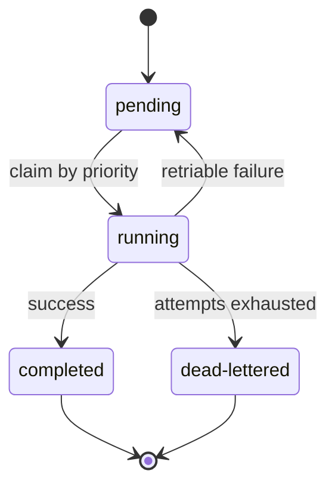

# SQLite Task Board for OpenCode

> A local, zero-trust task queue that bootstraps and runs one autonomous OpenCode execution agent with Python and SQLite.


## Overview

This project implements a small, local task board for a single autonomous execution agent. SQLite is the source of task state, [`AGENTS.md`](./AGENTS.md) is the operating contract, and [`agent.py`](./agent.py) is the runtime entry point.

The user only needs to direct OpenCode to `AGENTS.md`. The agent then creates the project scaffold, initializes `tasks.db`, seeds the first task queue, validates the runtime, and begins processing queued work without requiring manual setup.

The design favors predictable execution over unrestricted autonomy:

- Tasks are stored as JSON instructions in SQLite.
- Payloads must pass strict, action-specific JSON Schema validation.
- Only registered actions can execute.
- Task writes are constrained to `workspace/` after bootstrap.
- Subprocesses use argument lists, timeouts, and `shell=False`.
- Network requests are denied unless their protocol and host are allowed.
- Lifecycle and error events are emitted as structured JSONL.
- Failed work is retried up to its configured limit, then dead-lettered.

## Autonomous bootstrap

Point OpenCode at the repository's `AGENTS.md` file:

```text
Read AGENTS.md completely and follow its autonomous bootstrap protocol.
```

OpenCode performs the following sequence:

1. Resolves the repository root from the location of `AGENTS.md`.
2. Creates `opencode.json` first so future sessions automatically load the protocol.
3. Creates the required directories and scaffold files.
4. Writes safe, repository-relative configuration defaults.
5. Applies the initial SQLite migration.
6. Seeds the bootstrap task queue.
7. Compiles and checks the runtime.
8. Runs the static contract tests when `pytest` is available.
9. Claims and executes the first queued task.

No network access or secrets are required during bootstrap.

## Project layout

```text
sqlite-task-board/
├── AGENTS.md                      # Source of operating instructions
├── README.md                      # Project and operator documentation
├── opencode.json                  # OpenCode project configuration
├── agent.py                       # Runtime entry point
├── config.example.yaml            # Safe configuration template
├── config.yaml                    # Active local configuration
├── requirements.txt               # Runtime and test dependencies
├── .gitignore
├── migrations/
│   └── 0001_initial.sql           # Initial task-board schema
├── seeds/
│   └── bootstrap_tasks.sql        # Initial task queue
├── tests/
│   └── test_agent_contract.py     # Offline scaffold contract tests
└── workspace/
    └── .gitkeep                   # Default task write boundary
```

`workspace/` contains disposable task output. It is the only default writable location for ordinary task execution and can be deleted and recreated safely.

## How execution works

Each row in the `tasks` table contains an action type, a JSON instruction, priority, retry counters, status, and lifecycle timestamps. The agent recovers interrupted work at startup, claims one eligible task, validates it, enforces security policy, executes it, and records the result.


```mermaid
stateDiagram-v2
    state "dead-lettered" as dead_lettered
    [*] --> pending
    pending --> running: claim by priority
    running --> completed: success
    running --> pending: retriable failure
    running --> dead_lettered: attempts exhausted
    completed --> [*]
    dead_lettered --> [*]
```

Tasks are claimed in this order:

1. Priority: `critical`, `high`, `medium`, then `low`
2. Oldest `created_at`
3. Lowest task `id`

The claim is guarded by a transaction and a status check so a task cannot be claimed after it has left `pending`.

## Registered actions

The initial runtime exposes a deliberately small action surface.

| Action | Purpose | Primary controls |
| --- | --- | --- |
| `verify_runtime` | Confirm a supported runtime meets a minimum version | Fixed language enum, strict version format, subprocess timeout |
| `create_directories` | Create one or more directories | Workspace boundary, path traversal rejection, item limits |
| `setup_env_file` | Copy a non-secret environment template | Workspace boundary, explicit overwrite behavior |
| `install_dependencies` | Install from an approved manifest and registry | Approved manager, registry policy, hashes, timeout |
| `run_health_check` | Check an allowed HTTP or HTTPS endpoint | Protocol allowlist, host allowlist, short timeout |

Every payload must:

- Match the schema for its declared action.
- Include an `idempotency_key`.
- Contain no undeclared properties.
- Pass action registration and security-policy checks.

## Bootstrap queue

The initial seed creates three idempotent tasks:

| Priority | Action | Expected result |
| --- | --- | --- |
| `critical` | Verify Python 3.11 or newer | Completes when the runtime requirement is met |
| `high` | Create `workspace/logs`, `workspace/data`, and `workspace/tmp` | Completes within the workspace boundary |
| `low` | Check `http://127.0.0.1:0/health` | Fails cleanly and exercises final-failure handling |

The port `0` health check is intentionally unreachable. Its failure verifies error reporting and dead-letter behavior; it does not indicate a broken installation.

## Requirements

- Python 3.11 or newer
- SQLite, through Python's built-in `sqlite3` module
- [PyYAML](https://pypi.org/project/PyYAML/) 6.0 or newer
- [jsonschema](https://pypi.org/project/jsonschema/) 4.0 or newer
- [pytest](https://pypi.org/project/pytest/) 8.0 or newer for tests

The standalone `sqlite3` CLI is optional. When it is unavailable, bootstrap uses Python's standard-library SQLite support.

## Optional manual setup

Autonomous bootstrap is the primary workflow. These commands are provided for development, recovery, and inspection.

```bash
python -m venv .venv
source .venv/bin/activate
python -m pip install --upgrade pip
python -m pip install -r requirements.txt
```

Initialize the database with the SQLite CLI:

```bash
sqlite3 tasks.db < migrations/0001_initial.sql
sqlite3 tasks.db < seeds/bootstrap_tasks.sql
```

Or initialize it with Python when the CLI is not installed:

```bash
python - <<'PY'
from pathlib import Path
import sqlite3

with sqlite3.connect("tasks.db") as connection:
    connection.executescript(Path("migrations/0001_initial.sql").read_text())
    connection.executescript(Path("seeds/bootstrap_tasks.sql").read_text())
PY
```

## Running the agent

Validate configuration, schema compatibility, and runtime readiness:

```bash
python agent.py --check
```

Claim and process at most one task:

```bash
python agent.py --once
```

Run continuously until interrupted:

```bash
python agent.py
```

Preview execution without performing task mutations:

```bash
AGENT_DRY_RUN=true python agent.py --once
```

Use an alternate configuration file:

```bash
AGENT_CONFIG=./path/to/config.yaml python agent.py --check
```

## Configuration

`config.yaml` uses safe local defaults and contains no secrets. Copy `config.example.yaml` when you need to restore the baseline configuration.

| Section | Controls |
| --- | --- |
| `agent` | Workspace, database path, schema version, and protocol version |
| `task_board` | Default retry limit, claim limit, and replenishment limits |
| `security` | Write boundary, read-only paths, network allowlist, and package policy |
| `logging` | Log level, JSONL format, and output destination |

Repository-relative paths are resolved from the repository root. The runtime refuses to proceed when the configured schema version does not match the applied database migration.

## Security model

Ordinary task execution uses zero-trust defaults.

### Filesystem

- Bootstrap may create scaffold files only under the repository root.
- After bootstrap, task writes must remain inside `security.workspace_boundary`.
- `..` traversal and absolute paths outside the workspace are rejected.
- Referenced files are checked before use.

### Subprocesses

- Commands are passed as argument lists with `shell=False`.
- Each process receives a minimal environment and a timeout.
- Standard output and error are captured and truncated to 10 KB.
- Package installation is limited by manager and registry policy.

### Network

- Only HTTP and HTTPS endpoints are accepted.
- The destination host must match `security.network_allowlist`.
- Public registries are disabled by default.
- Bootstrap itself remains offline.

### Secrets

- Real secrets are never written into generated environment files.
- Sensitive keys are redacted before logging.
- Keys containing `password`, `secret`, `token`, `credential`, `api_key`, or `key` are treated as sensitive.

## Structured logging

The agent writes one JSON object per line to standard output. Every event contains a UTC `timestamp` and an `event` name. Task-scoped events also contain `task_id`.

```jsonl
{"timestamp":"2026-01-01T10:00:00Z","event":"STARTUP","protocol_version":"3.1"}
{"timestamp":"2026-01-01T10:00:01Z","event":"SCHEMA_CHECK_OK","schema_version":1}
{"timestamp":"2026-01-01T10:00:02Z","event":"EXEC_START","task_id":1,"action":"verify_runtime","attempt":1}
{"timestamp":"2026-01-01T10:00:03Z","event":"EXEC_END","task_id":1,"action":"verify_runtime","status":"completed"}
```

Required lifecycle events include startup, schema checks, recovery, execution, security alerts, queue replenishment, task release, and graceful shutdown.

## Retry and recovery

At startup, interrupted `running` tasks are recovered before new work is claimed:

- A task below its maximum attempt count returns to `pending`.
- A task at its maximum attempt count becomes `dead-lettered` with `INTERRUPTED_MAX_ATTEMPTS_EXCEEDED`.

Normal failures follow the same retry boundary:

- `attempt_count < max_attempts` returns the task to `pending`.
- `attempt_count >= max_attempts` moves the task to `dead-lettered`.

Protocol 3.1 does not require a delay between retries.

## Inspecting the task board

View the queue with the SQLite CLI:

```bash
sqlite3 -header -column tasks.db \
  "SELECT id, priority, action_type, status, attempt_count, max_attempts, error_code FROM tasks ORDER BY id;"
```

Inspect recent failures:

```bash
sqlite3 -header -column tasks.db \
  "SELECT id, action_type, status, error_code, error_message, failed_at FROM tasks WHERE status IN ('failed', 'dead-lettered') ORDER BY updated_at DESC;"
```

Treat direct database edits as an administrative recovery tool. Normal work should enter and progress through the queue so validation, idempotency, retries, and logging remain intact.

## Validation and tests

Run all offline validation checks:

```bash
python -m py_compile agent.py
python agent.py --check
python -m pytest tests
```

The static contract tests confirm that required files exist, `opencode.json` references `AGENTS.md`, migrations create the expected tables, bootstrap tasks are seeded, and `agent.py` exposes `ACTION_REGISTRY`.

No test requires external network access.

## Common errors

| Error code | Meaning | Suggested action |
| --- | --- | --- |
| `CONFIG_LOAD_FAILED` | Configuration could not be loaded | Install dependencies and validate `config.yaml` syntax |
| `SCHEMA_VERSION_MISMATCH` | Configured and applied schema versions differ | Apply the expected migration or restore the matching configuration |
| `INVALID_JSON` | Task instruction is not valid JSON | Correct the queued instruction |
| `SCHEMA_VALIDATION_FAILED` | Payload does not match its strict action schema | Remove unsupported fields and supply all required values |
| `UNKNOWN_ACTION` | Action is not in `ACTION_REGISTRY` | Register and test the action before queuing it |
| `PATH_OUTSIDE_WORKSPACE` | A task attempted an out-of-bound write | Use a path under the configured workspace |
| `PATH_TRAVERSAL_ATTEMPT` | A path contains unsafe traversal | Replace it with a normalized workspace-relative path |
| `UNAPPROVED_HOST` | Network host is not allowlisted | Add an explicitly reviewed host or change the endpoint |
| `UNAPPROVED_PROTOCOL` | URL does not use HTTP or HTTPS | Use an allowed protocol |
| `PROCESS_TIMEOUT` | A subprocess exceeded its limit | Diagnose the command or adjust its bounded timeout |
| `MAX_ATTEMPTS_EXCEEDED` | The task exhausted its retries | Inspect its logged error and enqueue a corrected task |

## Adding an action

New capabilities should preserve the same narrow execution model:

1. Define a strict JSON Schema with `additionalProperties: false`.
2. Require a valid `idempotency_key`.
3. Implement the action with explicit filesystem, process, and network checks.
4. Register the handler in `ACTION_REGISTRY`.
5. Add offline tests for valid, invalid, and adversarial payloads.
6. Document the action, side effects, and recovery behavior.
7. Queue work through SQLite instead of calling the handler directly.

Do not weaken global policy to accommodate one action. Extend the smallest relevant allowlist or schema and keep the change reviewable.

## Operational notes

- SQLite is the authoritative task-state store.
- `AGENTS.md` is the authoritative protocol document.
- `config.yaml` intentionally remains in version control because its defaults contain no secrets.
- Database files, runtime output, virtual environments, editor metadata, and local secret files are ignored by Git.
- `workspace/.gitkeep` preserves the writable workspace directory without committing task output.
- Queue replenishment must remain within the configured batch and daily generation limits.

## Troubleshooting

### PyYAML or jsonschema is missing

Install the declared dependencies:

```bash
python -m pip install -r requirements.txt
```

The runtime fails closed when safe configuration loading or schema validation is unavailable.

### `sqlite3` is not installed

Use the Python initialization snippet above. The runtime itself uses Python's built-in `sqlite3` module and does not require the CLI.

### A task remains in `running`

Restart the agent. Startup recovery returns the task to `pending` when attempts remain, or dead-letters it when its attempt limit has been reached.

### The bootstrap health check fails

This is expected. The seeded endpoint uses local port `0` specifically to exercise controlled failure and dead-letter handling.

### A legitimate path or host is blocked

Review the task and extend the narrowest relevant setting in `config.yaml`. Avoid broad workspace roots, wildcard network access, or public registry access unless the risk is explicitly accepted.

## Source of truth

This README is an operator guide. If it conflicts with [`AGENTS.md`](./AGENTS.md), the protocol in `AGENTS.md` takes precedence.
```bash
python agent.py
```

---

## Runtime Modes

| Command | Purpose |
|---------|---------|
| `python agent.py --check` | Validate configuration and runtime readiness |
| `python agent.py --once` | Execute one queued task |
| `python agent.py` | Run the continuous task loop |
| `AGENT_DRY_RUN=true python agent.py --once` | Validate and plan without persisting task changes |

---

## Acceptance Criteria

Bootstrap is complete when:
- Project scaffold exists
- `opencode.json` references `AGENTS.md`
- `tasks.db` is initialized and migrated
- Bootstrap tasks are seeded
- `python agent.py --check` passes

---

## Summary

**One file (`AGENTS.md`) → one command (open in Opencode) → a fully functional SQLite-backed agent runtime.**
All future work is queued, validated, and executed locally through the task board.
